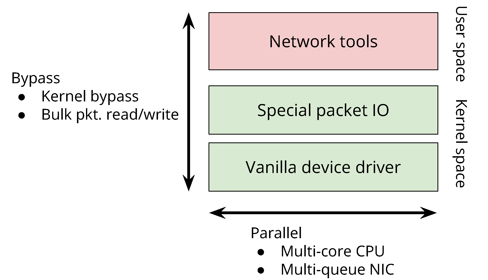

---

# mgcap: A Multi-thread Pcap capturing tool with Hardware timestamping

## sora, aom

---

# ねらい

* 現在の高精度時刻同期されたDC環境を踏まえて、ネットワーク計測環境の整備を考える
*

* 性能目標
  - 一般的にDC環境における平均パケット長は、ユーザ環境に比べてとても短い
  - 極端な例としては、Facebookで200 Byte以下[SIGCOMM'15]、Googleで100 Byte程度[NSDI'16]
  - 10GE環境平均パケット長100 Byteは、11M pps程度のパケット処理性能が必要
* 必要な機能
  - PTPd, VM環境(仮想ネットワーク機能)との併用
  -

---

# アプローチ

* Yet Another kernel-bypass network IO

* 高精度タイムスタンピング


---

# Two column layout


{.column}

1.

---

# Approach



---

# Slides can have an inline image


---

# Slides local images

---

# Slides can have many images

{pad=10}
{pad=10}
{pad=10}
{pad=10}
{pad=10}

---

# Slides can have code

```javascript
// Print hello
function hello() {
  console.log('Hello world');
}
```

---
# Slides can have tables

Animal | Number
-------|--------
Fish   | 142 million
Cats   | 88 million
Dogs   | 75 million
Birds  | 16 million
